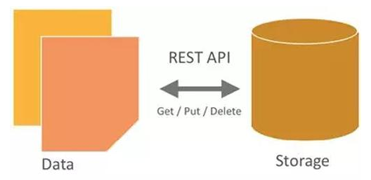
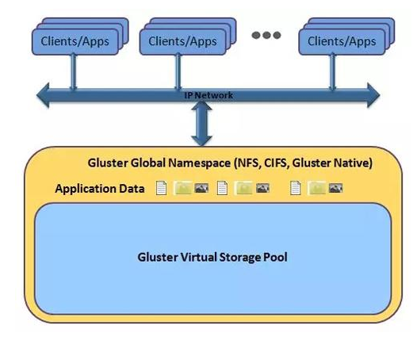
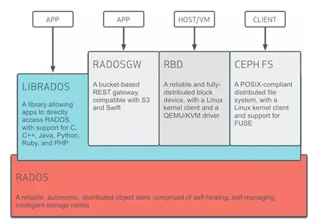
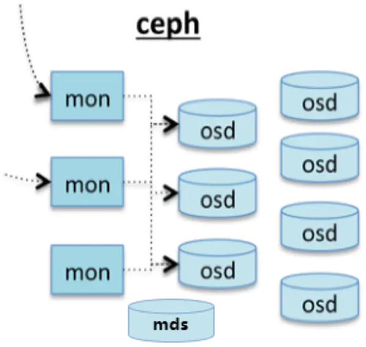
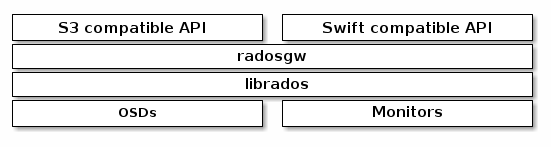
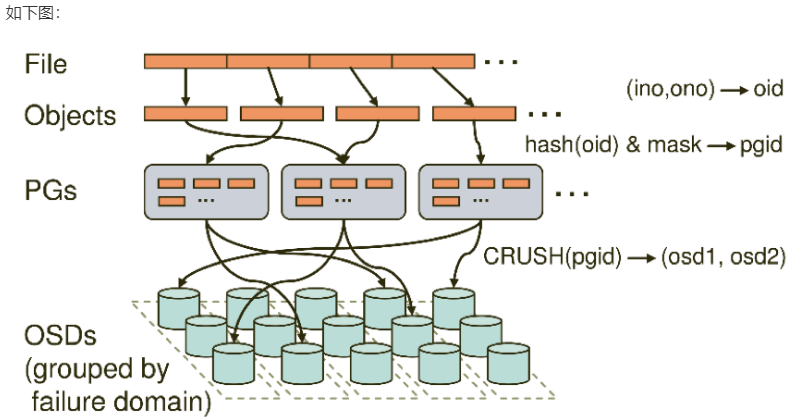
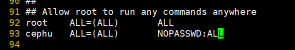
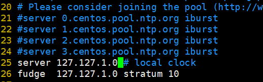
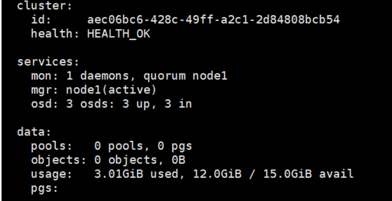
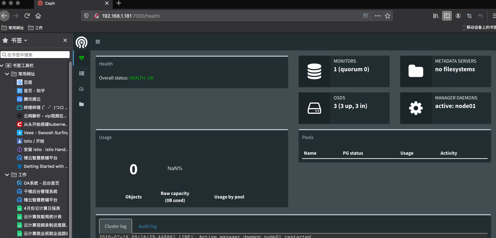

# 分布式存储Ceph

## 存储分类

```shell
本地文件系统
    ext3 ext4 xfs ntfs
            
网络文件系统
	共享的是文件系统。
    非分布式
    	nfs           网络文件系统
    分布式
    	hdfs          分布式网络文件系统
    	glusterfs     分布式网络文件系统

                             client
                                |
                            namenode          元数据服务器    
                                |
                ------------------------------------
                |               |                  |
              datanode        datanode            datanode
 
	注意：
		分布式文件系统的元数据服务器存储的各个数据的位置信息
		对象存储服务的的元数据服务器存储的是数据的属性信息
	
	非分布式文件系统
        典型设备： FTP、NFS服务器
            为了克服块存储文件无法共享的问题，所以有了文件存储。
            在服务器上架设FTP与NFS服务，就是文件存储。

        优点：
            造价低，随便一台机器就可以了。
            方便文件共享。

        缺点：
            读写速率低。
            传输速率慢。

        使用场景：
            日志存储。
            有目录结构的文件存储。
    
    分布式文件系统的特性
    	可扩展
        分布式存储系统可以扩展到几百台甚至几千台的集群规模，而且随着集群规模的增长，系统整体性能表现为线性增长。分布式存储的水平扩展有以下几个特性：
          1) 节点扩展后，旧数据会自动迁移到新节点，实现负载均衡，避免单点过热的情况出现;
          2) 水平扩展只需要将新节点和原有集群连接到同一网络，整个过程不会对业务造成影响;
          3) 当节点被添加到集群，集群系统的整体容量和性能也随之线性扩展，此后新节点的资源就会被管理平台接管，被用于分配或者回收。
          
     
     在集群之中会有很多一小块一小块的数据，也就是说在做分布式的时候，会将数据进行多次分割，每个一小部分的数据都会有多个副本，当一个副本坏掉了，就回到别的节点上进行查找
      
      
      
        低成本
        分布式存储系统的自动容错、自动负载均衡机制使其可以构建在普通的PC机之上。另外，线性扩展能力也使得增加、减少机器非常方便，可以实现自动运维。

        高性能
        无论是针对整个集群还是单台服务器，都要求分布式存储系统具备高性能。

        易用
        分布式存储系统需要能够提供易用的对外接口，另外，也要求具备完善的监控、运维工具，并能够与其他系统集成。

        易管理
        可通过一个简单的WEB界面就可以对整个系统进行配置管理，运维简便，极低的管理成本。
        分布式存储系统的挑战主要在于数据、状态信息的持久化，要求在自动迁移、自动容错、并发读写的过程中保证数据的一致性。分布式存储涉及的技术主要来自两个领域：分布式系统以及数据库。

块存储                    
	主要是将裸磁盘空间映射给主机使用的。
    SAN(存储区域网)

    典型设备： 磁盘阵列，硬盘

    优点：
        通过Raid与LVM等手段，对数据提供了保护。
        多块廉价的硬盘组合起来，提高容量。
        多块磁盘组合出来的逻辑盘，提升读写效率。

    缺点：
        采用SAN架构组网时，光纤交换机，造价成本高。
        主机之间无法共享数据。

    使用场景：
        Docker容器、虚拟机磁盘存储分配。
        日志存储。
        文件存储。

对象存储                   
    为什么需要对象存储？
    首先，一个文件包含了属性（术语叫metadata，元数据，例如该文件的大小、修改时间、存储路径等）以及内容（以下简称数据）。

    例如FAT32这种文件系统，存储过程是链表的形式。

    而对象存储则将元数据独立了出来，控制节点叫元数据服务器（服务器+对象存储管理软件），里面主要负责存储对象的属性（主要是对象的数据被打散存放到了那几台分布式服务器中的信息），而其他负责存储数据的分布式服务器叫做OSD，主要负责存储文件的数据部分。当用户访问对象，会先访问元数据服务器，元数据服务器只负责反馈对象存储在哪些OSD，假设反馈文件A存储在B、C、D三台OSD，那么用户就会再次直接访问3台OSD服务器去读取数据。

    这时候由于是3台OSD同时对外传输数据，所以传输的速度就加快了。当OSD服务器数量越多，这种读写速度的提升就越大，通过此种方式，实现了读写快的目的。

    另一方面，对象存储软件是有专门的文件系统的，所以OSD对外又相当于文件服务器，那么就不存在文件共享方面的困难了，也解决了文件共享方面的问题。

    所以对象存储的出现，很好地结合了块存储与文件存储的优点。

    优点：
        具备块存储的读写高速。
        具备文件存储的共享等特性。

    使用场景： (适合更新变动较少的数据)
        图片存储。
        视频存储。                 
```

分布式数据存储的三种类型：

==非结构化的数据：主要是数据之间的关联系不大，像文本图片之类的数据==
 ==结构化的数据：数据之间关联系很大，关系型数据库这种，可以用表进行表示的==
 ==半结构化的数据：介于上述两种数据类型之间，数据之间的关系简单，典型的代码是html文件==


### 常见分布式存储

#### Hadoop HDFS

HDFS（Hadoop Distributed File System）是一个分布式文件系统,是hadoop生态系统的一个重要组成部分，是hadoop中的的存储组件.HDFS是一个高度容错性的系统，HDFS能提供高吞吐量的数据访问，非常适合大规模数据集上的应用。

HDFS的优点：
   1.  高容错性 
            数据自动保存多个副本
            副本丢失后,自动恢复
   2.  良好的数据访问机制 
            一次写入、多次读取,保证数据一致性
   3.  适合大数据文件的存储
            TB、 甚至PB级数据 
            扩展能力很强

HDFS的缺点：
   1.  低延迟数据访问
           难以应付毫秒级以下的应用
   2.  海量小文件存取
           占用NameNode大量内存
   3.  一个文件只能有一个写入者 
           仅支持append(追加)

#### OpenStack的对象存储Swift



OpenStack Object Storage（Swift）是OpenStack开源云计算项目的子项目之一。Swift的目的是使用普通硬件来构建冗余的、可扩展的分布式对象存储集群，存储容量可达PB级。Swift的是用Python开发

其主要特点为：

1. 各个存储的节点完全对等，是对称的系统架构。

2. 开发者通过一个RESTful HTTP API与对象存储系统相互作用。
3. 无单点故障:Swift的元数据存储是完全均匀随机分布的，并且与对象文件存储一样，元数据也会存储多份。整个Swift集群中，也没有一个角色是单点的。
4. 在不影响性能的情况下，集群通过增加外部节点进行扩展。
5. 无限的可扩展性：这里的扩展性分两方面，一是数据存储容量无限可扩展；二是Swift性能（如QPS、吞吐量等）可线性提升，扩容只需简单地新增机器，系统会自动完成数据迁移等工作，使各存储节点重新达到平衡状态。
6. 极高的数据持久性

==Swift可以用以下用途：==

​	==图片、文档存储==
==长期保存的日志文件==
==存储媒体库(照片、音乐、视频等)== 
==视频监控文件的存档== 
==总结：Swift适合用来存储大量的、长期的、需要备份的对象。==

#### 公有云对象存储

公有云大都有对象存储

Amazon类似产品就是S3： http://aws.amazon.com/s3;

微软类似产品Azure Bolb：http://azure.microsoft.com/en-us/documentation/articles/storage-dotnet-how-to-use-blobs/;

阿里类似的有OSS：https://www.aliyun.com/product/oss/;

阿里云对象存储OSS
阿里云对象存储服务（Object Storage Service，简称 OSS），是阿里云提供的海量、安全、低成本、高可靠的云存储服务

存储类型（Storage Class）

​	OSS 提供标准、低频访问、归档三种存储类型

​	标准存储类型提供高可靠、高可用、高性能的对象存储服务，能够支持频繁的数据访问；			低频访问存储类型适合长期保存不经常访问的数据（平均每月访问频率 1 到 2 次），存储单价低于标准类型；

​	归档存储类型适合需要长期保存（建议半年以上）的归档数据，在三种存储类型中单价最低。

应用场景

​	1、图片和音视频等应用的海量存储
OSS可用于图片、音视频、日志等海量文件的存储。
​			2、云端数据处理
上传文件到OSS后，可以配合媒体处理服务和图片处理服务进行云端的数据处理。

​	3、网页或者移动应用的静态和动态资源分离
利用海量互联网带宽，OSS可以实现海量数据的互联网并发下载。

#### GlusterFS分布式文件系统



GlusterFS（GNU ClusterFile System）是一种全对称的开源分布式文件系统，所谓全对称是指GlusterFS采用弹性哈希算法，没有中心节点，所有节点全部平等。GlusterFS配置方便，稳定性好，可轻松达到PB级容量，数千个节点，2011年被红帽收购。
    
PB级容量  高可用性 基于文件系统级别共享 分布式 去中心化

glusgerfs存储卷的类型

基本类型：条带，复制，哈希。
复合卷
复合卷就是分布式复制，分布式条带，分布式条带复制卷，像分布式复制，分布式条带这两个是比较常用的，像分布式条带复制卷三种揉一块儿的用的都比较少，

各种卷的整理

分布卷：存储数据时，将文件随机存储到各台glusterfs机器上。
        

​	优点：存储数据时，读取速度快
​        

​	缺点：一个birck坏掉，文件就会丢失

分布卷是随机分配的

复制卷：存储数据时，所有文件分别存储到每台glusterfs机器上。
        

​	优点：对文件进行的多次备份，一个brick坏掉，文件不会丢失，其他机器的brick上面有备份
​        

​	缺点：占用资源

条带卷：存数据时，一个文件分开存到每台glusterfs机器上
        

​	优点：对大文件，读写速度快
​        

​	缺点：一个brick坏掉，文件就会坏掉

## Ceph详解

### Ceph简介

Ceph使用C++语言开发，遵循LGPL协议开源。Sage Weil(Ceph论文发表者)于2011年创立了以Inktank公司主导Ceph的开发和社区维护。2014年Redhat收购inktank公司，并发布Inktank Ceph企业版（ICE）软件，业务场景聚焦云、备份和归档，支持对象存储和块存储以及文件系统存储应用。出现Ceph开源社区版本和Redhat企业版。

Ceph主要设计的初衷是变成一个可避免单节点故障的统一的分布式文件系统，提供较好的性能、可靠性和PB级别的扩展能力，而且是一种开源自由软件，许多超融合的分布式文件系统都是基于Ceph开发的。

### Ceph特性

高扩展性：使用普通x86服务器，支持10~1000台服务器，支持TB到EB级的扩展。

高可靠性：没有单点故障，多数据副本，自动管理，自动修复。

高  性  能：数据分布均衡。
可用于对象存储，块设备存储和文件系统存储

### Ceph架构



**基础存储系统RADOS**
	

​	Reliable, Autonomic, Distributed Object Store，即可靠的、自动化的、分布式的对象存储。所有存储在Ceph系统中的用户数据事实上最终都是由这一层来存储的。Ceph的高可靠、高可扩展、高性能、高自动化等等特性本质上也是由这一层所提供的。

**基础库librados**

​	这一层的功能是对RADOS进行抽象和封装，并向上层提供API，以便直接基于RADOS进行应用开发。特别注意，RADOS是一个对象存储系统，因此，librados实现的API也只是针对对象存储功能的。

​	因为RADOS是协议很难直接访问，因此上层的RBD、RGW和CephFS都是通过librados访问的，目前提供PHP、Ruby、Java、Python、C和C++支持。

**高层应用接口**

​	radosgw: 对象网关接口(对象存储)

​	rbd: 块存储

​	cephfs：文件系统存储
其作用是在librados库的基础上提供抽象层次更高、更便于应用或客户端使用的上层接口。

### Ceph的基本组件



Ceph主要有三个基本进程

**Osd**
	Object Storage Device：对象存储设备

​	OSD全称Object Storage Device，也就是负责响应客户端请求返回具体数据的进程。一个Ceph集群一般都有很多个OSD。用于集群中所有数据与对象的存储。处理集群数据的复制、恢复、回填、再均衡。并向其他osd守护进程发送心跳，然后向Mon提供一些监控信息。
当Ceph存储集群设定数据有两个副本时（一共存两份），则至少需要两个OSD守护进程即两个OSD节点，集群才能达到active+clean状态。

**MDS**

​	MDS全称Ceph Metadata Server，是CephFS服务依赖的==元数据服务。==为Ceph文件系统提供元数据计算、缓存与同步（也就是说，Ceph 块设备和 Ceph 对象存储不使用MDS ）。在ceph中，元数据也是存储在osd节点中的，mds类似于元数据的代理缓存服务器。MDS进程并不是必须的进程，只有需要使用CEPHFS时，才需要配置MDS节点。

**Monitor**
	

​	监控整个集群的状态，维护集群的cluster MAP二进制表，保证集群数据的一致性。ClusterMAP描述了对象块存储的物理位置，以及一个将设备聚合到物理位置的桶列表。

**Manager**（ceph-mgr）
	

​	用于收集ceph集群状态、运行指标，比如存储利用率、当前性能指标和系统负载。对外提供 ceph dashboard（ceph ui）和 resetful api。Manager组件开启高可用时，至少2个

**Ceph 结构包含两个部分**

​	ceph client：访问 ceph 底层服务或组件，对外提供各种接口。比如：对象存储接口、块存储接口、文件级存储接口。

​	ceph node：ceph 底层服务提供端，也就是 ceph 存储集群。


### Ceph组件及概念介绍

Object
	

​	Ceph最底层的存储单元是Object对象，每个Object包含元数据和原始数据。

PG
	

​	PG全称Placement Grouops，是一个逻辑的概念，一个PG包含多个OSD。引入PG这一层其实是为了更好的分配数据和定位数据。

CRUSH
	

​	CRUSH是Ceph使用的数据分布算法，类似一致性哈希，让数据分配到预期的地方。

RBD
	

​	RBD全称RADOS block device，是Ceph对外提供的块设备服务。

RGW
	

​	RGW全称RADOS gateway，是Ceph对外提供的对象存储服务，接口与S3和Swift兼容。
Ceph对象网关是一个对象存储接口，建立在该对象之上， librados为应用程序提供了通往Ceph存储集群的RESTful网关。

CephFS 
	

​	CephFS全称Ceph File System，是Ceph对外提供的文件系统服务。
是个 POSIX 兼容的文件系统，它使用 Ceph 存储集群来存储数据。 Ceph 文件系统与 Ceph 块设备、同时提供 S3 和 Swift API 的 Ceph 对象存储、或者原生库（ librados ）一样，都使用着相同的 Ceph 存储集群系统。

Ceph对象存储

​	使用Ceph对象网关守护进程（`radosgw`），它是用于与Ceph存储群集进行交互的HTTP服务器。由于它提供与OpenStack Swift和Amazon S3兼容的接口，因此Ceph对象网关具有其自己的用户管理。Ceph对象网关可以将数据存储在用于存储来自Ceph文件系统客户端或Ceph块设备客户端的数据的同一Ceph存储群集中。S3和Swift API共享一个公共的名称空间，因此您可以使用一个API编写数据，而使用另一个API检索数据。



CEPH 块存储

块是一个字节序列（例如，一个 512 字节的数据块）。基于块的存储接口是最常见的存储数据方法，它们基于旋转介质，像硬盘、 CD 、软盘。无处不在的块设备接口使虚拟块设备成为与 Ceph 这样的海量存储系统交互的理想之选。

Ceph 块设备是精简配置的、大小可调且将数据条带化存储到集群内的多个 OSD 。 Ceph 块设备利用 RADOS 的多种能力，如快照、复制和一致性。 Ceph 的 RADOS 块设备（ RBD ）使用内核模块或 librbd 库与 OSD 交互。


### Ceph数据的存储过程



无论使用哪种存储方式（对象、块、挂载），存储的数据都会**被切分成对象（Objects）**。Objects size大小可以由管理员调整，通常为2M或4M。每个对象都会有一个**唯一的OID，由ino与ono生成**，虽然这些名词看上去很复杂，其实相当简单。ino即是文件的File ID，用于在全局唯一标示每一个文件，而ono则是分片的编号。比如：**一个文件FileID为A，它被切成了两个对象，一个对象编号0，另一个编号1，那么这两个文件的oid则为A0与A1**。Oid的好处是可以唯一标示每个不同的对象，并且存储了对象与文件的从属关系。由于ceph的所有数据都虚拟成了整齐划一的对象，所以在读写时效率都会比较高。

但是对象并不会直接存储进OSD中，因为对象的size很小，在一个大规模的集群中可能有几百到几千万个对象。这么多对象光是遍历寻址，速度都是很缓慢的；并且如果将对象直接通过某种固定映射的哈希算法映射到osd上，当这个osd损坏时，对象无法自动迁移至其他osd上面（因为映射函数不允许）。为了解决这些问题，ceph引入了归置组的概念，即PG。

PG是一个逻辑概念，我们linux系统中可以直接看到对象，但是无法直接看到PG。它在数据寻址时类似于数据库中的索引：每个对象都会固定映射进一个PG中，所以当我们要寻找一个对象时，只需要先找到对象所属的PG，然后遍历这个PG就可以了，无需遍历所有对象。而且在数据迁移时，也是以PG作为基本单位进行迁移，ceph不会直接操作对象。

对象时如何映射进PG的？还记得OID么？首先使用静态hash函数对OID做hash取出特征码，用特征码与PG的数量去模，得到的序号则是PGID。由于这种设计方式，PG的数量多寡直接决定了数据分布的均匀性，所以合理设置的PG数量可以很好的提升CEPH集群的性能并使数据均匀分布。

最后PG会根据管理员设置的副本数量进行复制，然后通过crush算法存储到不同的OSD节点上（其实是把PG中的所有对象存储到节点上），第一个osd节点即为主节点，其余均为从节点。

### 安装Ceph集群

注        意:   版本更新非常快，有问题要看官方文档

官方文档：
http://docs.ceph.com/docs/master

```shell
准备环境
系统版本：centos7.4 x86_64 server
硬件配置：5台vm，1核1G内存，每台node角色的机器至少挂载1块不低于5个G的空闲盘为osd存储

    主机名                 ip                       role
    admin            192.168.153.130               admin--安装ceph-deploy
    node1            192.168.153.131               mon / mgr / osd 
    node2            192.168.153.132               osd
    node3            192.168.153.133               osd
    ceph-client      192.168.153.134
    
1.给三台node节点添加一块大小5G以上的磁盘。
2.所有节点修改主机名并相互解析
3.关闭所有机器的防火墙和selinux
4.所有节点创建普通用户并设置密码--所有节点都操作
[root@admin ~]# useradd cephu
[root@admin ~]# passwd cephu

5.确保各 Ceph 节点上新创建的用户都有 sudo 权限--所有节点操作
[root@admin ~]# visudo  ----在root ALL=(ALL) ALL下面添加：
cephu ALL=(root) NOPASSWD:ALL
```



```shell
6.实现ssh无密码登录（admin节点操作）
[root@admin ~]# su - cephu
[cephu@admin ~]$ ssh-keygen

7.将admin节点cephu用户生成的密钥拷贝到各Ceph节点：
[cephu@admin ~]$ ssh-copy-id cephu@node1
[cephu@admin ~]$ ssh-copy-id cephu@node2
[cephu@admin ~]$ ssh-copy-id cephu@node3
[cephu@admin ~]$ ssh-copy-id cephu@ceph-client

8.在admin节点用root用户添加~/.ssh/config配置文件，并进行如下设置，这样 ceph-deploy 就能用你所建的用户名登录 Ceph 节点了
[root@admin ~]# mkdir ~/.ssh
[root@admin ~]# vim ~/.ssh/config
Host node1
Hostname node1
User cephu

Host node2
Hostname node2
User cephu

Host node3
Hostname node3
User cephu
```


```shell
9.添加下载源，安装ceph-deploy（admin节点，root用户）
[root@admin ~]# vim /etc/yum.repos.d/ceph.repo
[ceph-noarch]
name=Ceph noarch packages
baseurl=https://download.ceph.com/rpm-luminous/el7/noarch
enabled=1
gpgcheck=1
type=rpm-md
gpgkey=https://download.ceph.com/keys/release.asc

更新源，安装ceph-deploy：
[root@admin ~]# yum makecache
[root@admin ~]# yum update
开启yum缓存
[root@admin ~]# vim /etc/yum.conf
keepcache=1
安装
[root@admin ~]# yum install ceph-deploy wget unzip -y

10.安装ntp（所有节点）
#注意！！选择任何一台机器当ntp时间服务器，其他的节点当时间服务器的客户端跟服务器同步时间
我选择的是admin上:
[root@admin ~]# yum install -y ntp
[root@admin ~]# vim /etc/ntp.conf  #有4行server的位置，把那4行server行注释掉，填写以下两行
server 127.127.1.0 # local clock
fudge  127.127.1.0 stratum 10
```



```shell
[root@admin ~]# systemctl start ntpd
[root@admin ~]# systemctl status ntpd
其他所有节点：
# yum install ntpdate  -y
# ntpdate  时间服务器ip
```

```shell
部署ceph集群
#注意！！没有特别说明以下所有操作均是在admin节点，cephu用户下执行
1.创建cephu操作的目录：
[root@qfedu.com-admin ~]# su - cephu
[cephu@admin ~]$ mkdir my-cluster   #之后，所有ceph-deploy命令操作必须在该目录下执行

2.创建集群---这里报错查看后面的错误整理
首先在这里需要先下载一个包并安装否则会报错，然后在创建集群
[cephu@admin ~]$ wget https://files.pythonhosted.org/packages/5f/ad/1fde06877a8d7d5c9b60eff7de2d452f639916ae1d48f0b8f97bf97e570a/distribute-0.7.3.zip
[cephu@admin ~]$ unzip distribute-0.7.3.zip
[cephu@admin ~]$ cd distribute-0.7.3
[cephu@admin distribute-0.7.3]$ sudo python setup.py install
创建集群
[cephu@admin ~]$ cd my-cluster/
[cephu@admin my-cluster]$ ceph-deploy new node1
[cephu@admin my-cluster]$ ls
ceph.conf  ceph-deploy-ceph.log  ceph.mon.keyring
创建成功会有三个文件：ceph.conf, ceph.mon.keyring, and a log file

3.安装luminous-12.2.13在(脚本方式在admin节点)
目标：在node1,node2,node3三个节点上安装ceph和ceph-radosgw主包
方法1：利用官方脚本全自动安装
#脚本会帮助node1,node2,node3创建epel源和ceph源，并且自动安装ceph和ceph-radosgw主包
[cephu@admin my-cluster]$ ceph-deploy install --release luminous node1 node2 node3
#这一步时间很长，容易超时，可以利用手动安装

如果ceph和ceph-radosgw安装不上，则采用方法2
在千锋做实验要注意epel的源(切记)
测试是否安装完成：分别在node1 node2 node3中确认安装版本为12.2.13
 [cephu@node1 ~]$ ceph --version 
ceph version 12.2.13 (584a20eb0237c657dc0567da126be145106aa47e) luminous (stable)


方法2：手动部署安装三台机器分别创建：三台node节点相同操作
    1）安装epel源
    # yum install -y epel-release
    2）创建Ceph源，内容如下：官方源
    # vim /etc/yum.repos.d/ceph.repo
[Ceph]
name=Ceph packages for $basearch
baseurl=http://download.ceph.com/rpm-luminous/el7/$basearch
enabled=1
gpgcheck=1
type=rpm-md
gpgkey=https://download.ceph.com/keys/release.asc
priority=1

[Ceph-noarch]
name=Ceph noarch packages
baseurl=http://download.ceph.com/rpm-luminous/el7/noarch
enabled=1
gpgcheck=1
type=rpm-md
gpgkey=https://download.ceph.com/keys/release.asc
priority=1

[ceph-source]
name=Ceph source packages
baseurl=http://download.ceph.com/rpm-luminous/el7/SRPMS
enabled=1
gpgcheck=1
type=rpm-md
gpgkey=https://download.ceph.com/keys/release.asc
priority=1

#下面的是阿里云的ceph源
# vim /etc/yum.repos.d/ceph.repo
[Ceph]
name=Ceph packages for $basearch
baseurl=http://mirrors.aliyun.com/ceph/rpm-luminous/el7/$basearch
enabled=1
gpgcheck=0
type=rpm-md
gpgkey=https://mirrors.aliyun.com/ceph/keys/release.asc
priority=1

[Ceph-noarch]
name=Ceph noarch packages
baseurl=http://mirrors.aliyun.com/ceph/rpm-luminous/el7/noarch
enabled=1
gpgcheck=0
type=rpm-md
gpgkey=https://mirrors.aliyun.com/ceph/keys/release.asc
priority=1

[ceph-source]
name=Ceph source packages
baseurl=http://mirrors.aliyun.com/ceph/rpm-luminous/el7/SRPMS
enabled=1
gpgcheck=0
type=rpm-md
gpgkey=https://mirrors.aliyun.com/ceph/keys/release.asc
priority=1

    3)分别在node1，node2，node3节点执行下面命令安装软件,可以完全手动安装，但需要yum的ceph缓存目录结构
    $sudo yum install ceph ceph-radosgw  -y    
    如果因为速度慢导致安装失败可以按ctrl+c，利用它创建的yum缓存目录，手动把安装包下载下来保存到缓存目录/var/cache/yum/x86_64/Ceph/packages目录下
    再次执行安装命令：
    $sudo yum install ceph ceph-radosgw  -y

测试是否安装完成：分别在node1 node2 node3中确认安装版本为12.2.13    
[cephu@node1 ~]$ ceph --version 
ceph version 12.2.13 (584a20eb0237c657dc0567da126be145106aa47e) luminous (stable)
```

```shell
4.初始化mon：admin节点--cephu用户执行
[cephu@admin my-cluster]$ ceph-deploy mon create-initial

5.赋予各个节点使用命令免用户名权限：
[cephu@admin my-cluster]$ ceph-deploy admin node1 node2 node3

6.安装ceph-mgr：只有luminous才有，为使用dashboard做准备
[cephu@admin my-cluster]$ ceph-deploy mgr create node1

7.添加osd：
注意：各个节点上提供存储空间的磁盘大小不能太小，最好5G以上，注意检查你的磁盘名字
[cephu@admin my-cluster]$ ceph-deploy osd create --data /dev/sdb node1
[cephu@admin my-cluster]$ ceph-deploy osd create --data /dev/sdb node2
[cephu@admin my-cluster]$ ceph-deploy osd create --data /dev/sdb node3
命令中/dev/sdb是在各个节点上为osd准备的空闲磁盘（无需分区格式化，如果有分区需要指定具体分区），通过如下命令查看：
[cephu@admin my-cluster]$ ssh node1 lsblk -f


最后通过如下命令查看集群状态：
[cephu@admin my-cluster]$ ssh node1 sudo ceph -s
如果显示health_ok，3个osd up就成功了
```

 

**Dashboard的配置**

```shell
在node1上操作
把ceph-mgr和ceph-mon安装在同一个主机上，最好只有一个ceph-mgr
[root@node1 ~]# su - cephu

1.创建管理域秘钥：
[cephu@node1 ~]$ sudo ceph auth get-or-create mgr.node1 mon 'allow profile mgr' osd 'allow *' mds 'allow *'
[mgr.node1]
	key = AQAePadeYsvJLxAA9Pnmib3S+0Kj1jAeuSQcKw==

2.开启 ceph-mgr 管理域
[cephu@node1 ~]$ sudo ceph-mgr -i node1

3.查看ceph的状态：确认mgr的状态为active
[cephu@node1 ~]$ sudo ceph status
  cluster:
    id:     aec06bc6-428c-49ff-a2c1-2d84808bcb54
    health: HEALTH_OK
 
  services:
    mon: 1 daemons, quorum node1
    mgr: node1(active, starting)
    osd: 3 osds: 3 up, 3 in
 
  data:
    pools:   0 pools, 0 pgs
    objects: 0 objects, 0B
    usage:   3.01GiB used, 12.0GiB / 15.0GiB avail
    pgs:
    
4.打开dashboard模块：
[cephu@node1 ~]$ sudo ceph mgr module enable dashboard

5.绑定开启dashboard模块的ceph-mgr节点的ip地址：
[cephu@node1 ~]$ sudo ceph config-key set mgr/dashboard/node1/server_addr 192.168.153.136
set mgr/dashboard/node1/server_addr
# ip地址为mgr节点的ip地址,也就是node1的ip地址

5.web登录：浏览器地址栏输入：
 mgr地址:7000
```



**到这里Ceph分布式集群完成！**

**配置客户端使用rbd**

```shell
创建块设备之前需要创建存储池，存储池相关命令需要在mon节点执行--也就是规划好的node1节点
创建存储池：
[cephu@node1 ~]$ sudo ceph osd pool create rbd 128 128
pool 'rbd' created

初始化存储池
[cephu@node1 ~]$ sudo rbd pool init rbd

准备客户端client(客户端操作)：
升级client内核到最新版本
更新前，内核版本为：
[root@ceph-client ~]# uname -r 
3.10.0-693.el7.x86_64

升级方法
导入key
[root@client ~]# rpm --import https://www.elrepo.org/RPM-GPG-KEY-elrepo.org

安装elrepo的yum源
[root@client ~]# rpm -Uvh http://www.elrepo.org/elrepo-release-7.0-2.el7.elrepo.noarch.rpm

查看可用的系统内核包
[root@client ~]# yum --disablerepo="*" --enablerepo="elrepo-kernel" list available

安装内核
[root@client ~]# yum --enablerepo=elrepo-kernel install  kernel-ml-devel kernel-ml -y

查看内核默认启动顺序
[root@client ~]# awk -F\' '$1=="menuentry " {print $2}' /etc/grub2.cfg 
CentOS Linux (5.7.8-1.el7.elrepo.x86_64) 7 (Core)
CentOS Linux (3.10.0-1062.el7.x86_64) 7 (Core)
CentOS Linux (0-rescue-f0079ffdc1064b91b9f525935ca9c3e7) 7 (Core)

选择处于0位置的新内核为默认启动内核
[root@client ~]# grub2-set-default 0
[root@client ~]# reboot

重启后的内核版本:
[root@client ~]# uname -r 
5.7.8-1.el7.elrepo.x86_64

删除旧内核
[root@client ~]# yum remove kernel -y

client安装ceph：
环境准备参考部署ceph文档开头环境准备的2-5步

安装依赖包、epel、配置ceph源
[root@client ~]# yum install -y  python-setuptools  epel-release
[root@client ~]# vim /etc/yum.repos.d/ceph.repo
[Ceph]
name=Ceph packages for $basearch
baseurl=http://mirrors.aliyun.com/ceph/rpm-luminous/el7/$basearch
enabled=1
gpgcheck=0
type=rpm-md
gpgkey=https://mirrors.aliyun.com/ceph/keys/release.asc
priority=1

[Ceph-noarch]
name=Ceph noarch packages
baseurl=http://mirrors.aliyun.com/ceph/rpm-luminous/el7/noarch
enabled=1
gpgcheck=0
type=rpm-md
gpgkey=https://mirrors.aliyun.com/ceph/keys/release.asc
priority=1

[ceph-source]
name=Ceph source packages
baseurl=http://mirrors.aliyun.com/ceph/rpm-luminous/el7/SRPMS
enabled=1
gpgcheck=0
type=rpm-md
gpgkey=https://mirrors.aliyun.com/ceph/keys/release.asc
priority=1

[root@client ~]# yum install ceph ceph-radosgw  -y
[root@client ~]# ceph --version
ceph version 12.2.13 (584a20eb0237c657dc0567da126be145106aa47e) luminous (stable)

在admin节点赋予client使用命令免用户名权限：
[cephu@admin my-cluster]$ sudo ceph-deploy admin ceph-client

修改client下该文件的读权限：
[root@client ~]# chmod +r /etc/ceph/ceph.client.admin.keyring

修改client下的ceph配置文件：这一步是为了解决映射镜像时出错问题
[root@client ~]# vi /etc/ceph/ceph.conf #在global section下添加：
rbd_default_features = 1

client节点创建块设备镜像：单位是M，这里是4个G
[root@client ~]# rbd create foo --size 4096

client节点映射镜像到主机：
[root@client ~]# rbd map foo --name client.admin
/dev/rbd0

client节点格式化块设备：
[root@client ~]# mkfs.ext4 -m 0 /dev/rbd/rbd/foo

client节点mount块设备：
[root@client ~]# mkdir /mnt/ceph-block-device #创建挂载点
[root@client ~]# mount /dev/rbd/rbd/foo /mnt/ceph-block-device #挂载

客户端重起之后，设备需要重新作映射，不然可能会卡死
```

### 错误整理

```shell
[cephu@centos7u3_1 my-cluster]$ ceph-deploy new node1
Traceback (most recent call last):
  File "/bin/ceph-deploy", line 18, in <module>
    from ceph_deploy.cli import main
  File "/usr/lib/python2.7/site-packages/ceph_deploy/cli.py", line 1, in <module>
    import pkg_resources
ImportError: No module named pkg_resources

重新安装python的distribution：

下载 distribution : https://pypi.python.org/pypi/distribute
cd distribution-0.7.3/
sudo python setup.py install

distribution下载地址：
https://files.pythonhosted.org/packages/5f/ad/1fde06877a8d7d5c9b60eff7de2d452f639916ae1d48f0b8f97bf97e570a/distribute-0.7.3.zip


问题二
[ERROR ] admin_socket: exception getting command descriptions: [Errno 2] No such file or dir

cat /etc/ceph/ceph.conf
添加
public_network= 192.168.122.0/24
推送
ceph-deploy --overwrite-conf config push admin node1 node2 node3

https://www.cnblogs.com/aguncn/p/7352393.html 
https://blog.csdn.net/zhydream77/article/details/81041767


问题三:
ceph-deploy mon create-initial  时候
​```
[node1][INFO  ] Running command: sudo ceph --cluster=ceph --admin-daemon /var/run/ceph/ceph-mon.node1.asok mon_status
[node1][ERROR ] no valid command found; 10 closest matches:
[node1][ERROR ] perf reset <var>
[node1][ERROR ] perf histogram schema
[node1][ERROR ] log reopen
[node1][ERROR ] log flush
[node1][ERROR ] perf histogram dump {<logger>} {<counter>}
[node1][ERROR ] perf dump {<logger>} {<counter>}
[node1][ERROR ] git_version
[node1][ERROR ] get_command_descriptions
[node1][ERROR ] log dump
[node1][ERROR ] help
[node1][ERROR ] admin_socket: invalid command
[node1][WARNIN] monitor: mon.node1, might not be running yet
[node1][INFO  ] Running command: sudo ceph --cluster=ceph --admin-daemon /var/run/ceph/ceph-mon.node1.asok mon_status
[node1][ERROR ] no valid command found; 10 closest matches:
[node1][ERROR ] perf reset <var>
[node1][ERROR ] perf histogram schema
[node1][ERROR ] log reopen
[node1][ERROR ] log flush
[node1][ERROR ] perf histogram dump {<logger>} {<counter>}
[node1][ERROR ] perf dump {<logger>} {<counter>}
[node1][ERROR ] git_version
[node1][ERROR ] get_command_descriptions
[node1][ERROR ] log dump
[node1][ERROR ] help
[node1][ERROR ] admin_socket: invalid command
[node1][WARNIN] monitor node1 does not exist in monmap
​```

原因： 第一次在做的时候没有修改主机名是就生成了公私钥，结果拷贝的公钥有问题，在问题二推送配置的时候，排查后发现主机名的问题。
之后初始化mon的时候出错，排错两个小时，差点怀疑人生的时候突然发现，想起主机名的事情，就检查了以下公私钥，结果发现生成的公私钥是以原主机名生成的，删除后生成新的公私钥，传送公钥后，还是失败。
但是感觉已经找到了问题所在，继续排查，到node1查看日志发现，地址被占用，平复以下自己激动的心，然后冷静的杀掉进程，重新初始化OK


问题四：
ceph-deploy osd create --data /dev/vdc node3
[node1][WARNIN] ceph-volume lvm create: error: GPT headers found, they must be removed on: /dev/vdb
[node1][ERROR ] RuntimeError: command returned non-zero exit status: 2
[ceph_deploy.osd][ERROR ] Failed to execute command: /usr/sbin/ceph-volume --cluster ceph lvm create --bluestore --data /dev/vdb
[ceph_deploy][ERROR ] GenericError: Failed to create 1 OSDs


千万不要分区，然后重新加磁盘，重新做
有文档说加上参数也可以但是
ceph-deploy osd create --data /dev/vdc  --fs-type xfs node3 不行

[cephu@node1 ~]$ sudo ceph auth get-or-create mgr.node1 mon 'allow profile mgr' osd 'allow *' mds 'allow *'
[mgr.node1]
        key = AQD8HPdcmntqJRAAlZ3Aeialqq0nVcdcg+axqQ==

-------------
问题:rdb map出错rbd sysfs write failed
创建了一个rbd镜像
    $ rbd create --size 4096 docker_test
然后，在Ceph client端将该rbd镜像映射为本地设备时出错。
    $ rbd map docker_test --name client.admin

    rbd: sysfs write failed
    RBD image feature set mismatch. You can disable features unsupported by the kernel with "rbd feature disable".
    In some cases useful info is found in syslog - try "dmesg | tail" or so.

原因：
     rbd镜像的一些特性，OS kernel并不支持，所以映射失败。我们查看下该镜像支持了哪些特性。
    $ rbd info docker_test

    rbd image 'docker_test':
        size 4096 MB in 1024 objects
        order 22 (4096 kB objects)
        block_name_prefix: rbd_data.43702ae8944a
        format: 2
        features: layering, exclusive-lock, object-map, fast-diff, deep-flatten
        flags: 
    可以看到特性feature一栏，由于我OS的kernel只支持layering，其他都不支持，所以需要把部分不支持的特性disable掉。

方法一： 直接diable这个rbd镜像的不支持的特性：
    $ rbd feature disable docker_test exclusive-lock object-map fast-diff deep-flatten

方法二： 创建rbd镜像时就指明需要的特性，如：
    $ rbd create --size 4096 docker_test --image-feature layering
    
方法三： 如果还想一劳永逸
那么就在执行创建rbd镜像命令的服务器中，
修改Ceph配置文件/etc/ceph/ceph.conf，
在global section下，增加rbd_default_features = 1
再创建rdb镜像。
    $ rbd create --size 4096 docker_test

通过上述三种方法后，查看rbd镜像的信息。
    $ rbd info docker_test

    rbd image 'docker_test':
        size 4096 MB in 1024 objects
        order 22 (4096 kB objects)
        block_name_prefix: rbd_data.43a22ae8944a
        format: 2
        features: layering
        flags:

再次尝试映射rdb镜像到本地块设备，成功！
    $ rbd map docker_test --name client.admin  
    /dev/rbd0
======================================
问题:
[cephu@client ~]$ sudo  rbd map docker_test --name client.admin


rbd: sysfs write failed
In some cases useful info is found in syslog - try "dmesg | tail".
rbd: map failed: (110) Connection timed out

解决方案:
[cephu@client ~]$ sudo ceph osd crush tunables hammer
adjusted tunables profile to hammer

然后重新 
[cephu@client ~]$ sudo  rbd map docker_test --name client.admin
/dev/rbd0

成功

参考链接: https://randomopenstackthoughts.wordpress.com/2018/08/16/ceph-block-device/
=====================================

问题1:
2.3步骤中,如果由于网速太慢,可以如下操作
由于网速慢的问题，安装并不会成功。之所以仍进行这一步，只因执行过了该命令就会自动创建相应文件夹。在进入各个节点手动安装的时候，才能把下载的不成功的包放到正确的目录下，这样，手动安装使用yum命令才会成功。之后进入每个节点执行安装。
以node1为例：
• 先从https://download.ceph.com/rpm-luminous/el7/x86_64/ 下载所有最有最新版本的rpm包到本地

• 之后使用secure shell client上传到node1的/var/cache/yum/x86_64/7/Ceph/packages/文件夹下

• 然后安装ceph：
$ ssh node1
$ sudo yum install –y epel-release ceph ceph-radosgw
虽然所有安装包都在相应的目录中了，但仍可能不成功，这个时候只需要再次重新把安装包放到对应目录后再执行该命令就成功了，原因不明。
======================================
问题2:
2.3步骤中如果开启防火墙需要做如下操作
设置防火墙（由于node1既是mon节点又是osd节点，所以要添加下面两个规则。其他节点只开启ceph服务即可）：
$ sudo firewall-cmd --zone=public --add-service=ceph-mon --permanent  //该规则仅在mon节点执行，如果不添加就不能在其他osd上进行一些查询操作
$ sudo firewall-cmd --zone=public --add-service=ceph --permanent
$ sudo firewall-cmd --reload
注意:该防火墙规则只能在安装成功ceph后才能添加，否则就不识别，添加失败。最后退出node1节点，返回admin节点
~~~~~~~~~~~~~~~~~~~~~~~~~~~~~~~~~
问题3：
激活 OSD 的时候需要先把OSD所在服务器的目录所有者和所属组手动改成ceph，不然无法激活
[root@vm42 yum.repos.d]# chown ceph:ceph /var/local/osd2

~~~~~~~~~~~~~~~~~~~~~~~~~~~~~~~~~
问题4：
ceph:health_warn clock skew detected on mon的解决办法
造成集群状态health_warn：clock skew detected on mon节点的原因有两个，一个是mon节点上ntp服务器未启动，另一个是ceph设置的mon的时间偏差阈值比较小。
 排查时也应遵循先第一个原因，后第二个原因的方式。

第一步：确认ntp服务是否正常工作

第二步：修改ceph配置中的时间偏差阈值
1. 在admin部署节点修改配置参数：
# vi ~/my-cluster/ceph.conf在global字段下添加：
mon clock drift allowed = 2
mon clock drift warn backoff = 30    

2. 向需要同步的mon节点推送配置文件：
# ceph-deploy --overwrite-conf config push node{1..3}这里是向node1 node2 node3推送，也可以后跟其它不联系节点
 3. 重启mon服务（centos7环境下）
# systemctl restart ceph-mon.target4.验证：
# ceph -s显示health_ok说明问题解决

问题5：
有些场景下，对osd进行一些操作，但是并不想要集群进行数据恢复，此时，可以通过设置noout标志来实现：
[root@node3 ~]# ceph osd set noout
noout is set
[root@node3 ~]# ceph -s
  cluster:
    id:     b8b4aa68-d825-43e9-a60a-781c92fec20e
    health: HEALTH_WARN
            noout flag(s) set
 
  services:
    mon: 1 daemons, quorum node1
    mgr: node1(active)
    osd: 6 osds: 6 up, 6 in
         flags noout
 
  data:
    pools:   0 pools, 0 pgs
    objects: 0 objects, 0 bytes
    usage:   6339 MB used, 55100 MB / 61440 MB avail
    pgs:     去除noout标志命令：
[root@node3 ~]# ceph osd unset noout
noout is unset
[root@node3 ~]# ceph -s
  cluster:
    id:     b8b4aa68-d825-43e9-a60a-781c92fec20e
    health: HEALTH_OK
 
  services:
    mon: 1 daemons, quorum node1
    mgr: node1(active)
    osd: 6 osds: 6 up, 6 in
 
  data:
    pools:   0 pools, 0 pgs
    objects: 0 objects, 0 bytes
    usage:   6339 MB used, 55100 MB / 61440 MB avail
    pgs:     

==================================================

Error: Package: 2:librbd1-12.2.12-0.el7.x86_64 (Ceph)            
   Requires: liblttng-ust.so.0()(64bit

方法1
sudo yum install -y yum-utils && sudo yum-config-manager --add-repo https://dl.fedoraproject.org/pub/epel/7/x86_64/ &&sudo  yum install --nogpgcheck -y epel-release &&sudo  rpm --import /etc/pki/rpm-gpg/RPM-GPG-KEY-EPEL-7 &&sudo  rm -f /etc/yum.repos.d/dl.fedoraproject.org*

方法二：
yum install epel-release   -y
 
wget https://dl.fedoraproject.org/pub/epel/7/x86_64/Packages/e/epel-release-7-12.noarch.rpm
 
rpm -Uvh epel-release*rpm
 
yum install lttng-ust -y
```

